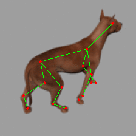
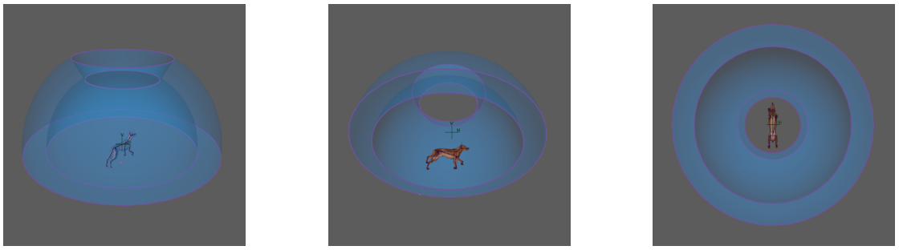

# F-CNN Pose Machines (Quadruped Subjects)

This is a Python and TensorFlow implementation of Convolutional Pose Machines to infer joint locations from RGB images of quadruped subjects. The general pose-estimation problem can be described as below:

  
 
 
  

Fully-Convolutional Neural Networks are trained to regress belief maps over the image area which indicate the probability of a specific joint to be in a specific pixel. Therefore, for example, for 15 joints, there are 15 heatmaps. Figure 5 below shows the data from a single training example.

The ground truth data was procedurally generated using 3D modelling software MAYA. The parameters that vary are:
* Quadruped Pose
  * Leg joints angles
  * Hip Orientation
  * Head Orientation
  * Mouth opening
* Viewing Angle

## Requisites

This project makes use of the following frameworks/libraries
* Python 3
* TensorFlow 1.4+
* OpenCV 2
* Matplotlib
* Numpy
* Pillow

## How it works
[TODO]

## F-CNN Convolutional Pose Machine Architecture
There are a couple different models under /models which incorporate the following:
* Different feature extraction architectures: Original, VGG16, SLIM, ...
* Different stage sub-module structures (per-stage feature extractor vs one feature for all stages)

Models can be modified or one can create a new model. If you create a new model, base it off the existing models as a starting point.  
The image below gives an idea of how the stage cascaded approach works. Each stage can contain its own feature extractor and heatmap regressor. Each stage works on both the input image and the feature maps from previous stages. Local/Intermediate supervision is enforced, therefore each stage refines the probability heatmap estimate for each joint.

 

## Dataset

  
 
 

 
